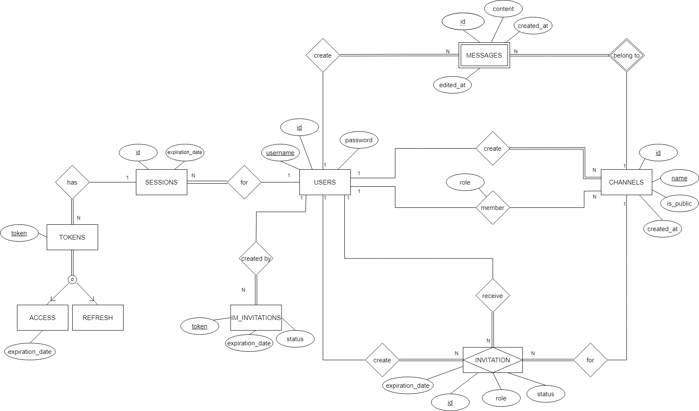

# Table of Contents
- [Backend](#backend)
  - [Introduction](#introduction)
  - [Api Documentation](#api-documentation)
  - [Application Structure](#application-structure)
    - [Host](#host)
    - [Http-Api](#http-api)
    - [Services](#services)
    - [Repository](#repository)
      - [Repository Transaction Manager](#repository-transaction-manager)
      - [JPA Repository](#jpa-repository)
      - [In-Memory Repository](#in-memory-repository)
    - [Domain](#domain)
    - [Error Handling](#error-handling)
    - [Deployment](#deployment)
  - [Database Model](#database-model)
    - [Conceptual Model](#conceptual-model)
    - [Physical Model](#physical-model)

---

# Backend

----

## Introduction

The backend is a RESTful API built with Kotlin and Spring Boot on the JVM. 

The application is divided into modules, each with a specific responsibility, such as handling the HTTP requests, processing the business logic, and accessing the database.

The main dependencies are:
* **[Spring Web](https://spring.io/)**: for building the RESTful API.
* **[Spring Data JPA](https://spring.io/projects/spring-data-jpa)**: for accessing the database.
* **[PostgresSQL](https://www.postgresql.org/)**: for the database.

----

## Api Documentation

The API documentation, with the list of endpoints, request and response models, and error responses, can be found in the [OpenAPI Specification](./instant-messaging-api-spec.yml)

----

## Application Structure

The project is divided into the following modules: 

* [`im-host`](../code/jvm/im-host/src/main/kotlin/im) - contains the main application class and configurations;
* [`im-http-api`](../code/jvm/im-http-api/src/main/kotlin/im) - contains the RESTful API controllers, request and response models;
* [`im-services`](../code/jvm/im-services/src/main/kotlin/im) - contains the business logic of the application;
* [`im-repository`](../code/jvm/im-repository/src/main/kotlin/im) - contains the generic repository data access layer;
* [`im-repository-jpa`](../code/jvm/im-repository-jpa/src/main/kotlin/im) - contains the JPA implementation of the repository;
* [`im-repository-mem`](../code/jvm/im-repository-mem/src/main/kotlin/im) - contains the in-memory implementation of the repository;
* [`im-domain`](../code/jvm/im-domain/src/main/kotlin/im) - contains the domain models;
* [`im-database`](../code/jvm/im-database/src) - contains the PostgresSQL database schema and scripts;

---

### Host
The [Host](../code/jvm/im-host/src/main/kotlin/im) module contains the main application class and configurations. It is responsible for initializing the 
Spring Boot application and providing the necessary configurations, such as [Beans](https://docs.spring.io/spring-framework/reference/core/beans/definition.html),
[Interceptors](https://docs.spring.io/spring-framework/docs/current/javadoc-api/org/springframework/web/servlet/HandlerInterceptor.html), and [Filters](https://docs.spring.io/spring-framework/docs/current/javadoc-api/org/springframework/web/filter/OncePerRequestFilter.html).

It has the following structure:

- [`App.kt`](../code/jvm/im-host/src/main/kotlin/im/App.kt) is the main application class that initializes the Spring Boot application;

- [`/configs`](../code/jvm/im-host/src/main/kotlin/im/configs) is the directory that contains the application configurations;

- [`/tasks`](../code/jvm/im-host/src/main/kotlin/im/tasks) is the directory that contains the scheduled tasks;

---

### Http-Api

The [Http-Api](../code/jvm/im-http-api/src/main/kotlin/im) module contains the RESTful API controllers, and is responsible
for receiving the HTTP requests, processing the input, and returning the response.

This module directly interacts with the [Services](#services) module to get the requests processed, and converts the 
service responses into output models, which are then sent to the client via the form of [`application/json`](https://datatracker.ietf.org/doc/html/rfc4627) for successful responses,
and [`application/json+problem`](https://datatracker.ietf.org/doc/html/rfc7807) for error responses.

It has the following structure:

- [`/controllers`](../code/jvm/im-http-api/src/main/kotlin/im/api/controllers) is the directory that contains the RESTful API controllers;
- [`/middlewares`](../code/jvm/im-http-api/src/main/kotlin/im/api/middlewares) is the directory that contains middlewares and defines
the HTTP pipeline for processing the requests;
- [`/model`](../code/jvm/im-http-api/src/main/kotlin/im/api/model) is the directory that contains the request and response models, 
as well as the validations for input models;
- [`/utils`](../code/jvm/im-http-api/src/main/kotlin/im/api/utils) is the directory that contains utility classes for the API, mainly used 
for getting and setting HTTP headers.

For input validation, the API uses [Jakarta Bean Validation](https://beanvalidation.org/2.0-jsr380/), 
which is a framework for validating Beans using annotations. 

This framework allows for custom annotations to be created, which were used to create domain-specific validations.

---

### Services

The [Services](../code/jvm/im-services/src/main/kotlin/im) module contains the business logic of the application. 
It is responsible for processing the requests received from the API, validating the business rules, and interacting with the
[Repository](#repository) module to access the data. 

The services communicate with the API and the Repository using the classes defined in the [Domain](#domain) module.

The services also define transaction delimitation using the [Repository Transaction Manager](#repository-transaction-manager),
and can be rolled back in case of an error. 

Each service has its own directory, which defines the service set of operations through an interface, and its implementation.

Additionally, some services have Configuration classes, which are used to define some parameterizable behavior of 
services, such as the invitation expiration time or the maximum number of sessions per user.

It has the following structure:

- [`/services`](../code/jvm/im-services/src/main/kotlin/im/services) contains the service interfaces and implementations;
- [`/services/auth`](../code/jvm/im-services/src/main/kotlin/im/services/auth) is the directory that contains the authentication services;
- [`/services/channel`](../code/jvm/im-services/src/main/kotlin/im/services/channels) is the directory that contains the channel services;
- [`/services/invitation`](../code/jvm/im-services/src/main/kotlin/im/services/invitations) is the directory that contains the invitation services;
- [`/services/user`](../code/jvm/im-services/src/main/kotlin/im/services/users) is the directory that contains the user services;
- [`/services/message`](../code/jvm/im-services/src/main/kotlin/im/services/messages) is the directory that contains the message services;

---

### Repository

The [Repository](../code/jvm/im-repository/src/main/kotlin/im) module contains the generic repository data access layer.

It defines the interfaces for the repositories, which are responsible for accessing the data from the database.

This module behaves as a bridge between the services and the database, providing a layer of abstraction for the services to access the data.

It has the following structure:

- [`/repository`](../code/jvm/im-repository/src/main/kotlin/im/repository) is the directory that contains the repository interfaces;
- [`/repository/pagination`](../code/jvm/im-repository/src/main/kotlin/im/repository/pagination) contains the pagination classes to 
be used when interacting with the repositories;
- [`/repository/repositories`](../code/jvm/im-repository/src/main/kotlin/im/repository/repositories) 
contains the generic repository interface with basic CRUD operations, as well as the specific repository interfaces for each domain model
which extend the generic repository interface to provide additional functionality;

#### Repository Transaction Manager

The repository also defines an interface for the [Transaction Manager](#repository-transaction-manager), which is used to delimit the transactions in the services.

This interface allows 

#### Jpa Repository

The [JPA Repository](../code/jvm/im-repository-jpa/src/main/kotlin/im) module contains the JPA implementation of the repository.

It provides the implementation for the repository interfaces defined in the [Repository](#repository) module, using the
[Spring Data JPA](https://spring.io/projects/spring-data-jpa) framework.

It defines the Entity classes that represent the database tables, as well as the JPA repositories that provide the
CRUD operations for the Entity classes which can be used to implement the generic repository interfaces.

It has the following structure:

- [`/repository/jpa/model`](../code/jvm/im-repository-jpa/src/main/kotlin/im/repository/jpa/model) contains the Entity classes that represent the database tables;
- [`/repository/jpa/repositories`](../code/jvm/im-repository-jpa/src/main/kotlin/im/repository/jpa/repositories) contains the repository implementations for the interfaces defined in the [Repository](#repository) module;
- [`/repository/jpa/transactions`](../code/jvm/im-repository-jpa/src/main/kotlin/im/repository/jpa/transactions) contains the Transaction Manager implementation;

#### In-Memory Repository

The [In-Memory Repository](../code/jvm/im-repository-mem/src/main/kotlin/im) module contains the in-memory implementation of the repository.

It provides an in-memory implementation of the repository interfaces defined in the [Repository](#repository) module, which can be used for testing purposes.

It has the following structure:

- [`/repository/mem`](../code/jvm/im-repository-mem/src/main/kotlin/im/repository/mem) contains the in-memory repository implementations for the interfaces defined in the [Repository](#repository) module;
- [`/repository/mem/model`](../code/jvm/im-repository-mem/src/main/kotlin/im/repository/mem/model) contains the in-memory models that represent the data stored in memory;
- [`/repository/mem/transactions`](../code/jvm/im-repository-mem/src/main/kotlin/im/repository/mem/transactions) contains the Transaction Manager implementation;

---

### Domain

The [Domain](../code/jvm/im-domain/src/main/kotlin/im) module contains the domain models used in the application.

It defines the classes that represent the entities of the application, such as User, Channel, Message, and Invitation.

The domain models are used as a middle ground between the services, the repository, and the API, providing a common language for the
different modules to communicate.

The API maps input models to domain models, which are then passed to the services for processing. The services then 
return domain models to the API, which are mapped to output models and sent to the client.

The JPA repository implementation maps domain models to Entity classes, which are then persisted in the database,
and mapped back to domain models when retrieved.

It has the following structure:
- [`/domain`](../code/jvm/im-domain/src/main/kotlin/im/domain) is the directory that contains the domain models as
well as the validators for domain models which require validation;

---

### Error Handling

To handle errors, the [Either](../code/jvm/im-domain/src/main/kotlin/im/domain/Either.kt) class was implemented
to represent the result of an operation that can either be a success or a failure.

This provides an alternative to throwing exceptions, allowing the services to return a result that can be 
either a success or a known failure, which can be handled by the API.

The application uses the [Problem Details for HTTP APIs](https://datatracker.ietf.org/doc/html/rfc7807) specification to handle errors.

When an input validation error occurs, the API returns a `400 Bad Request` response with a `application/json+problem` body
with the following structure:

```json
{
  "type": "https://github.com/isel-leic-daw/2024-daw-leic52d-im-i52d-2425-g07/tree/main/docs/problems/invalid-input",
  "title": "invalid-input",
  "status": 400,
  "detail": "Request input validation failed",
  "errors": [
    "Password cannot be blank",
    "Password must contain at least 1 lowercase letter(s)",
    "Password must contain at least 1 uppercase letter(s)",
    "Password must be between 8 and 80 characters",
    "Password must contain at least 1 digit(s)"
  ]
}
```

Whenever an error occurs at the service level, the API returns a Problem response with the appropriate status code and a detail message.

Example: 

```json
{
    "type": "https://github.com/isel-leic-daw/2024-daw-leic52d-im-i52d-2425-g07/tree/main/docs/problems/channel-not-found",
    "title": "channel-not-found",
    "status": 404,
    "detail": "Channel not found"
}
```

---

### Deployment

To deploy the application, you need to have [Docker](https://www.docker.com/) and [Gradle](https://gradle.org/) installed.

To build and run the backend application, you can use the following commands:

```shell
cd code/jvm
./gradlew build bootJar
```

This will build and run the backend application in your terminal, and you can access it at `http://localhost:8080`.

----

## Database Model


### Conceptual Model

The following diagram represents the ER model of the database:



The Conceptual Model enforces the following restrictions:

`User`:
- A user has a unique username and email;
- A user's username must be at most 30 characters long;
- A user's email must be at most 50 characters long and must follow a valid email format;

`ImInvitation`:
- An ImInvitation must have the status as `PENDING` or `USED`;

`Channel`:
- A channel must have a unique name;
- A channel's name must be at most 30 characters long;

`ChannelMember` (N:N relationship between `User` and `Channel`):
- A user's role in a channel must be `OWNER`, `MEMBER`, or `GUEST`;

`ChannelInvitation`:
- A channel invitation must have the status as `PENDING`, `ACCEPTED`, or `REJECTED`;
- A channel invitation can only be sent with the role `MEMBER` or `GUEST`;

Highlighted associations:
- A user can have multiple sessions which can have multiple tokens;
- tokens are associated with a single session;
- A user can create multiple ImInvitations;
- A user can be a member of multiple channels and a channel can have multiple members;
- A user can be invited to multiple channels and a channel can have multiple invitations;
- Each invitation is associated with a channel, an inviter, and an invitee;
- Each channel is associated with an owner, a set of members, and a set of invitations;
- A message is associated with a single sender and a single channel;
- A message is a Weak entity of a channel, meaning that it is dependent on the channel entity;
- A user can send multiple messages and a channel can have multiple messages;

Other application requirements and restrictions are enforced at the service level, such as (but not limited to):
- A user can only be a member of a channel if they have been invited to it;
- A user can only send messages to a channel if they are a member and have the necessary permissions;
- A user can only invite other users to a channel if they are an owner;

See the [Service](#services) module for the business logic that enforces these restrictions.

---

### Physical Model

The [`im-database`](../code/jvm/im-database/src) module contains the database schema and scripts.

It has the following scripts:

- [`schema.sql`](../code/jvm/im-database/src/schema.sql) - contains the schema definition of the database;
- [`insert_data`](../code/jvm/im-database/src/insert_data.sql) - contains the script to insert dummy data into the database for manual testing purposes;
- [`clear_data`](../code/jvm/im-database/src/clear_data.sql) - contains the script to clear the data from the database;
- [`triggers`](../code/jvm/im-database/src/triggers.sql) - contains the triggers for the database;

We highlight the following aspects of the physical model:

- Primary keys use the `SERIAL` type to auto-increment the values;
- Foreign keys are used to enforce the relationships between the tables;
- All the constraints defined in the Conceptual Model are enforced in the physical model;
- Indexes were used to optimize some queries, such as searching for messages in a channel by creation date;
- Triggers were used to enforce integrity constraints in situations where high concurrency could lead to
inconsistencies, such as ensuring that an ImInvitation can only be used once;